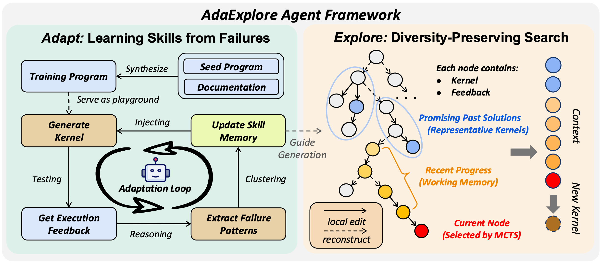
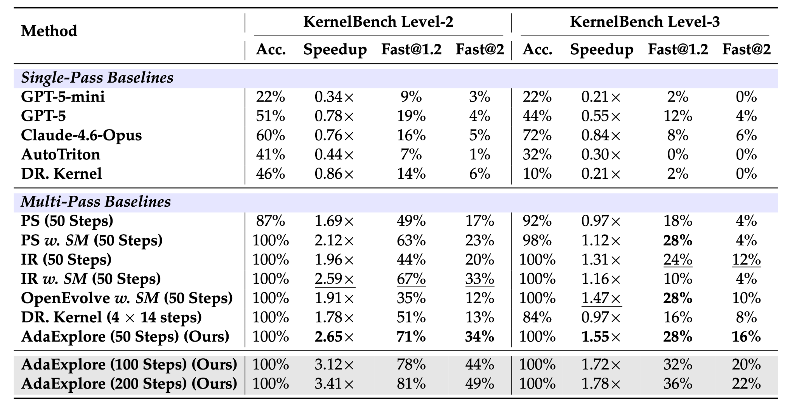

# AdaExplore

[](LICENSE)
[](https://arxiv.org/abs/2604.16625)

> **Weihua Du, Jingming Zhuo, Yixin Dong, Andre Wang He, Weiwei Sun, Zeyu Zheng, Manupa Karunaratne, Ivan Fox, Tim Dettmers, Tianqi Chen, Yiming Yang, Sean Welleck**  
> ["AdaExplore: Failure-Driven Adaptation and Diversity-Preserving Search for Efficient Kernel Generation " (2026)](https://arxiv.org/abs/2604.16625)

AdaExplore is a research codebase for **LLM-driven GPU kernel engineering**. The framework is built around two complementary stages:

- **Adapt**: synthesize training tasks, collect execution failures, and distill recurring error patterns into a reusable cross-task skill memory.
- **Explore**: optimize each target kernel with a diversity-preserving tree search that alternates between local refinement and larger structural regeneration.

This repository also includes the evaluation harness, synthetic task generation pipeline, and an optional remote evaluation service for multi-GPU or cluster setups.

<p align="center">
  
</p>

## Overview

AdaExplore addresses kernel generation with a two-stage workflow. The **Adapt** stage improves correctness by turning repeated compile/runtime failures on synthesized tasks into reusable constraint rules, which are then injected back into future prompts as skill memory. The **Explore** stage improves optimization quality by organizing candidate kernels as a search tree and balancing short-horizon local edits with broader structural jumps.

In practice, this repository is a simplified open-source release of AdaExplore, where:
- `synthesis/` generates the playground used for adaptation, 
- `skill_memory/` builds and updates the reusable memory, 
- `agent/` runs the search procedure used for benchmark or task-time optimization.

## TODOs

- [ ] The open-source release is still under refinement, and we welcome feedback!

## Installation

### 1. Create a Python environment and install dependencies

```bash
python -m venv .venv
source .venv/bin/activate
pip install -U pip
pip install -r requirements.txt
```

### 2. Configure model access

Set the API credentials for the backend you want to use:

```bash
# OpenAI
export OPENAI_API_KEY=...

# Azure OpenAI
export AZURE_OPENAI_ENDPOINT=...
export AZURE_API_KEY=...

# Anthropic
export ANTHROPIC_API_KEY=...
```

### 3. Start the evaluation service

Most provided configs use the remote evaluation service on port `12017`.

```bash
bash online_judge/start_server.sh
```

You can also launch it directly:

```bash
python -m uvicorn online_judge.app_with_queue:app --host 0.0.0.0 --port 12017
```

## Adapt: Failure-Driven Skill Acquisition

The adaptation stage corresponds to the first half of the paper: AdaExplore synthesizes diverse kernel-style tasks, runs the agent on them, and summarizes repeated failures into a cross-task memory of rules such as invalid Triton usage patterns. In this repo, that workflow is implemented by `synthesis/` for task generation and `skill_memory/` for extracting or updating the memory file.

We also provide a pre-generated skill memory at `results/memory/general_memory_v1_200.txt`, so you can use it directly as the starting point for exploration runs. To run this stage, you can directly use the pre-generated dataset in `datasets/KernelBench_syn/syn_v1`. 

(Optional) If you want to rebuild the synthetic dataset from scratch, generate the tasks and materialize them into the same KernelBench-style folder:

```bash
python synthesis/generate_data.py \
  --server_type azure \
  --model_name gpt-5-mini \
  --prompt_style composite \
  --input_levels 1 \
  --num_generations 200 \
  --num_examples_per_request 3 \
  --temperature 1.0

python synthesis/rename.py \
  --source_path outputs/data_generation/generated_data_composite_gpt-5-mini_YYYYMMDD_HHMMSS \
  --data_path datasets/KernelBench_syn/<your_dataset_name> \
  --force
```

Run the agent on the synthesized set with online memory updates enabled:

```bash
python agent/agent_entry.py --config config/SYN-v1/config_SYN-v1_none_MCTS.yaml
```

This config uses `memory_update: true`, so failed generations are distilled into `outputs/SYN-v1_example_run/general_memory.txt` as the run progresses. If you want to refresh the bundled memory from historical logs under `outputs/...`, you can also build it offline with:

```bash
python skill_memory/skill_memory.py \
  --log-dir outputs/example_run \
  --knowledge-store-path outputs/example_run/general_memory.txt \
  --server openai \
  --model-name gpt-5-mini \
  --max-logs 3000 \
  --seed 42
```

## Explore: Diversity-Preserving Kernel Search

The exploration stage corresponds to the second half of the paper: AdaExplore uses the skill memory collected during adaptation to guide search, while a tree-based optimizer preserves multiple candidate branches and alternates between local edits and structural reconstruction. In this repo, that behavior is implemented through the `MCTS` agent in `agent/agent_entry.py` and the benchmark configs under `config/`.

To reproduce the main benchmark runs, first make sure `general_memory_path` points to the collected memory file, then launch the provided configs:

```bash
python agent/agent_entry.py --config config/KB-l2/config_KB-l2_AdaExplore_50.yaml
python agent/agent_entry.py --config config/KB-l3/config_KB-l3_AdaExplore_50.yaml
```

These runs use `agent_type: MCTS`, inject the cross-task skill memory during proposal, and save search traces plus the best discovered kernels under `outputs/KB-l2_AdaExplore_50` and `outputs/KB-l3_AdaExplore_50`. If you want to evaluate a single task instead of a full test list, you can override the fields `--level` and `--problem_id` directly on the command line.

## Evaluation

AdaExplore uses a lightweight evaluation harness built around `online_judge/app_with_queue.py` and `src/eval_subprocess_runner.py`. The online judge exposes a API service with per-GPU bounded concurrency and queueing, so many agent workers can submit evaluations at once without oversubscribing a device; requests are routed to the least busy GPU and executed in isolated subprocesses to keep crashes or illegal memory accesses from taking down the main service.

For result quality, the harness separates correctness from performance measurement. Correctness is checked over one or more randomized trials and uses a small numerical tolerance (`atol=rtol=5e-2`) to avoid rejecting kernels over insignificant floating-point noise, while performance is measured after warmup across multiple runs and summarized into runtime statistics after removing outliers.

For post-processing, `tool_scripts/re_evaluate.py` can re-run the saved best kernels in a log directory, for example `python tool_scripts/re_evaluate.py --log_folder outputs/<run> --num_correct_trials 5 --num_perf_trials 100 --use_remote_eval`.
To summarize a completed run, use `tool_scripts/stats.py`, e.g. `python tool_scripts/stats.py --log_folder outputs/<run> --step 50`, which reports accuracy and aggregate speedup statistics.

## Results

<p align="center">
  
</p>

The main takeaway is that AdaExplore benefits from both stages of the pipeline: adaptation improves proposal quality by turning repeated failures into reusable guidance, and exploration converts that guidance into stronger search decisions at test time.
Across the reported benchmarks, this combination improves robustness and leads to better final kernels than using direct generation or search alone.

We also release the AdaExplore-generated kernels in `results/saved_kernels`; each kernel is the final output of a 50-step exploration run.

## Citation

@article{du2026adaexplore,
  title={AdaExplore: Failure-Driven Adaptation and Diversity-Preserving Search for Efficient Kernel Generation},
  author={Weihua Du and Jingming Zhuo and Yixin Dong and Andre Wang He and Weiwei Sun and Zeyu Zheng and Manupa Karunaratne and Ivan Fox and Tim Dettmers and Tianqi Chen and Yiming Yang and Sean Welleck},
  journal={arXiv preprint arXiv:2604.16625},
  year={2026}
}

## Acknowledgments
We thank [KernelBench](https://github.com/ScalingIntelligence/KernelBench) and [FlashInfer-Bench](https://github.com/flashinfer-ai/flashinfer-bench) for their open-source code and evaluation harnesses.

## License

This repository is released under the MIT License. See `LICENSE`.
